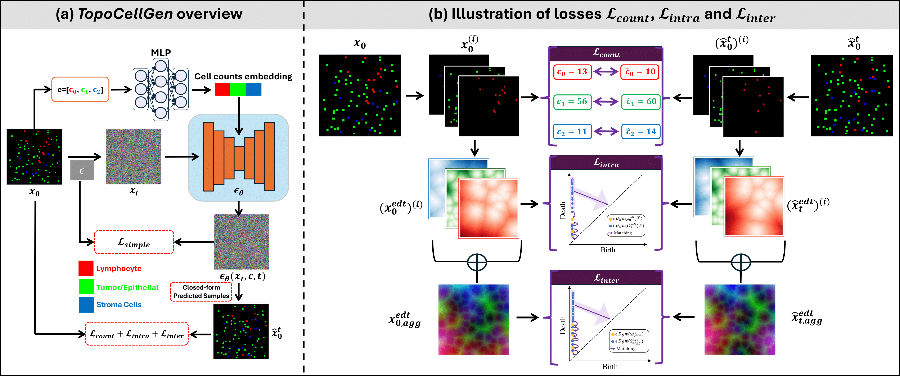
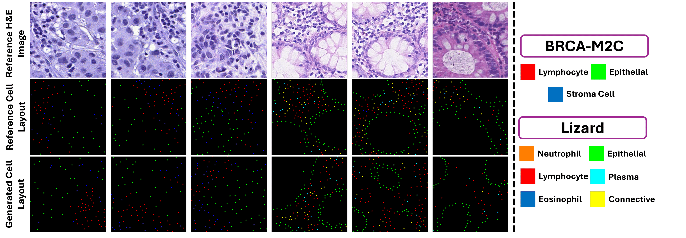
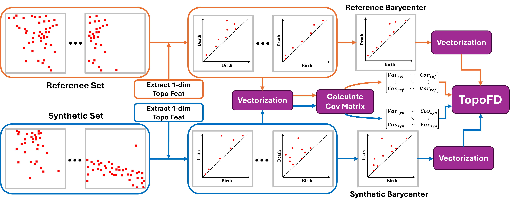

## <p align="center">[[CVPR 2025 (Oral)] TopoCellGen: Generating Histopathology Cell Topology with a Diffusion Model](https://arxiv.org/abs/2412.06011)</p>

**<p align="center">Meilong Xu<sup>1</sup>, Saumya Gupta<sup>1</sup>, Xiaoling Hu<sup>2</sup>, Chen Li<sup>1</sup>, Shahira Abousamra<sup>3</sup>, <br /> Dimitris Samaras<sup>1</sup>, Prateek Prasanna<sup>1</sup>, Chao Chen<sup>1</sup></p>**

<p align="center">
<sup>1</sup>Stony Brook University, NY, USA<br />
<sup>2</sup>Harvard Medical School and Massachusetts General Hospital, MA, USA<br />
<sup>3</sup>Department of Biomedical Data Science, Stanford University, CA, USA
</p>

<p align="center">
  
</p>

# Environment
Training and evaluation environment: Python 3.8.19, Pytorch 1.11.0, CUDA 11.3. Please run the following command to install required packages.
```
conda create -n topocellgen python=3.8
conda activate topocellgen

git clone https://github.com/Melon-Xu/TopoCellGen.git
cd /path/to/TopoCellGen
pip install -r requirements.txt
```

# Generating Cell Layouts
Use the following code to generate synthetic cell layouts for the BRCA-M2C testset:
```
python3 generate_layout_brca.py
```
After running it, the results are structured as follows:
```
/path/to/results/%Y-%M-%D/%H-%M-%S
  img/
  npy/
  cell_counts.json
```


# Evaluation
For the evaluation, you need to firstly set the paths to the reference and synthetic layouts, and then run:
```
cd /path/to/TopoCellGen/evaluate
python3 evaluate_BRCA.py
```
For the TopoFD evaluation, you can run:
```
python3 eval_TopoFD.py
```

# Qualitative Results
<p align="center">
  
</p>

# Topological Fréchet Distance
<p align="center">
  
</p>

# Download
- TopoCellGen pre-trained weights: [Google Drive](https://drive.google.com/drive/folders/1_C2Sc1GEkPOhneVnNAhYqqSHhki4aNCe?usp=sharing)
- BRCA-M2C dataset: You can assess the data from [official website](https://github.com/TopoXLab/Dataset-BRCA-M2C).
- Lizard dataset: You can assess the data from [official website](https://www.kaggle.com/datasets/aadimator/lizard-dataset/data)


# Citation
If you found this work useful, please consider citing our paper:
```bibtex
@inproceedings{xu2024topocellgen,
  title={TopoCellGen: Generating Histopathology Cell Topology with a Diffusion Model},
  author={Xu, Meilong and Gupta, Saumya and Hu, Xiaoling and Li, Chen and Abousamra, Shahira and Samaras, Dimitris and Prasanna, Prateek and Chen, Chao},
  booktitle={IEEE Conference on Computer Vision and Pattern Recognition (CVPR)},
  year={2025}
}
